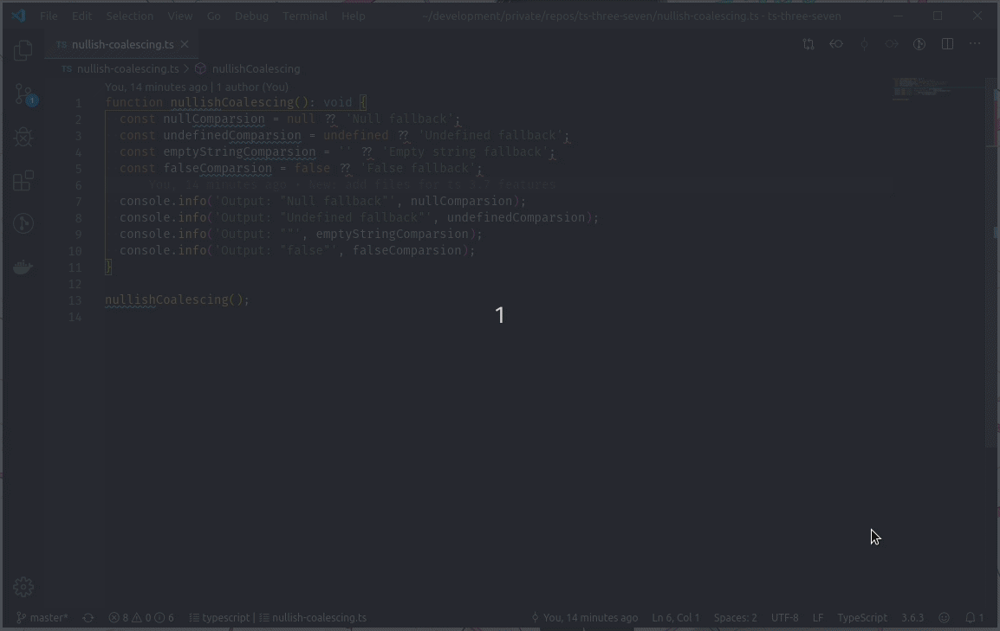

# [`ts-three-seven`](https://github.com/arbetsmyra/ts-three-seven)

TypeScript 3.7 - Optional chaining and nullish coalescing

[](https://github.com/arbetsmyra/eslint-config/blob/master/LICENSE)

## Installation

## Requirements

- `node` >= v10
- `npm` >= v5

Install dependencies.

```sh
npm install
```

Compile TypeScript code.

```sh
npm run build
```

Ensure that VSCode uses TypeScript 3.7.



## Usage

Execute `nullish-coalescing.js`.

```sh
node build/nullish-coalescing.js
```

Execute `build/optional-chaining.js`.

```sh
node build/optional-chaining.js
```

## License

[Unlicense © Arbetsmyra](https://choosealicense.com/licenses/unlicense/)
